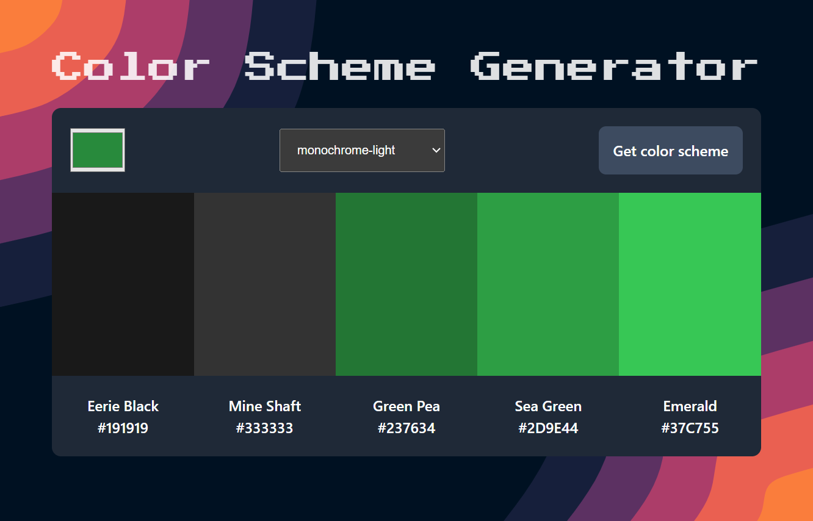

# Color Scheme Generator

A little tool that create a color scheme based on one color of your choice with the API from the [colorapi.com](https://www.thecolorapi.com/).
There is the feature to copy the hexa code when clicking on it.

🔗 **Live preview:** [here](https://hilarious-seahorse-4ef09e.netlify.app/)

### Screenshot

## Built with

### Technologies

- Vanilla JS
- HTML
- CSS

### Tools

- Vite

## Author

👤 **Edouard Desgrée**

- GitHub: [edesgree](https://github.com/edesgree)
